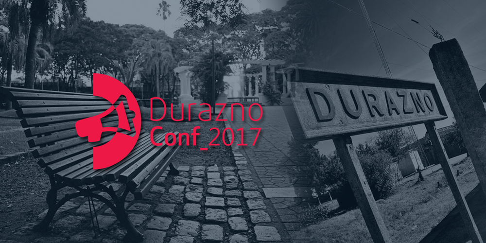
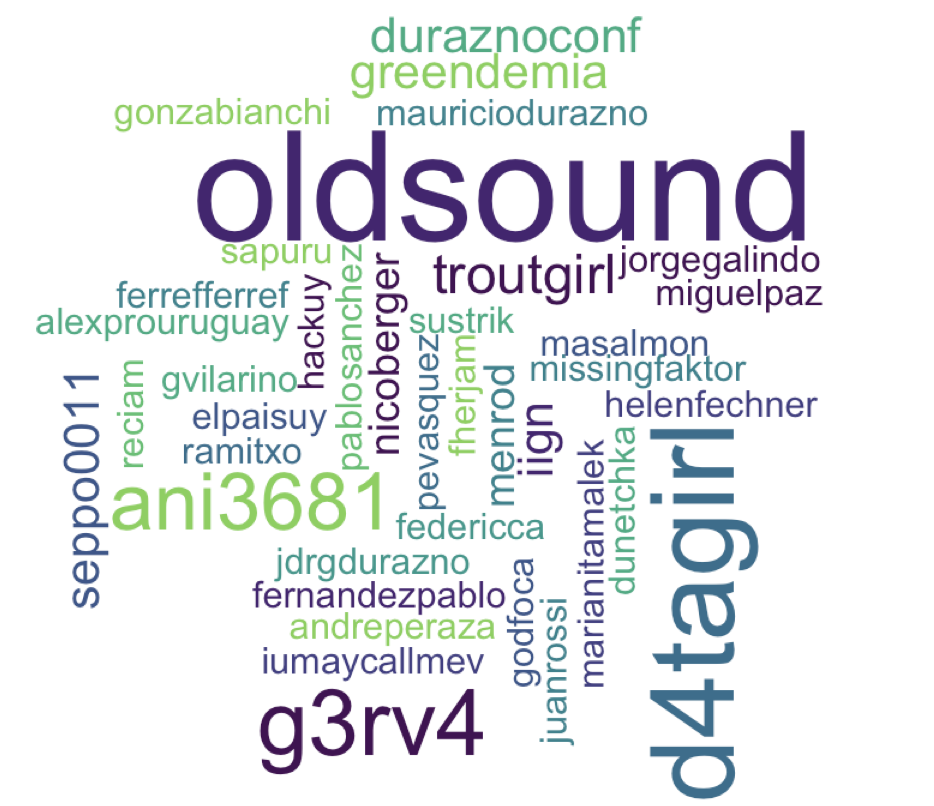
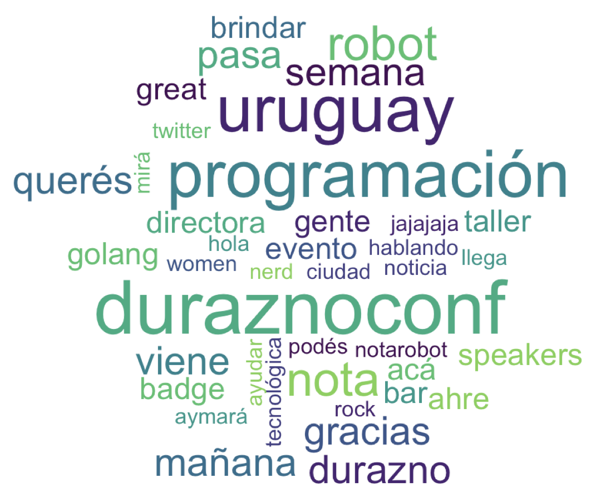
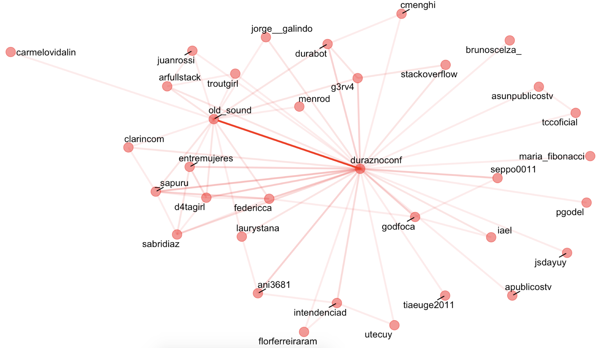
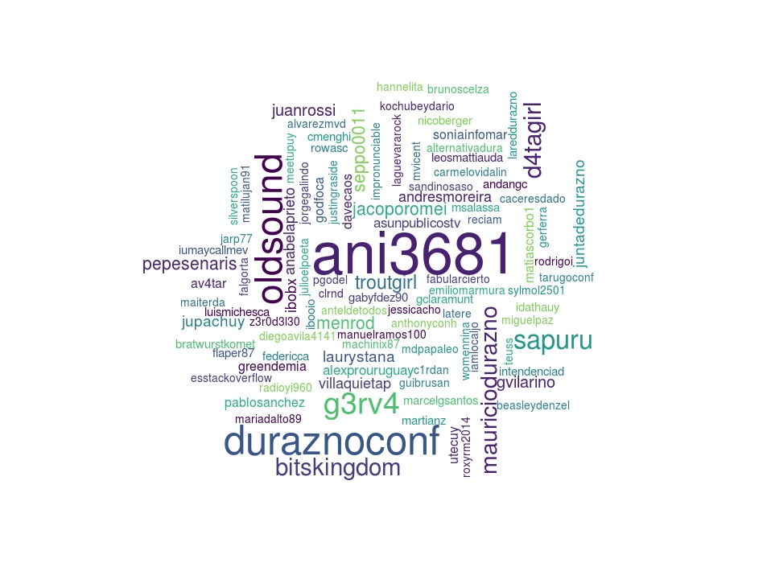
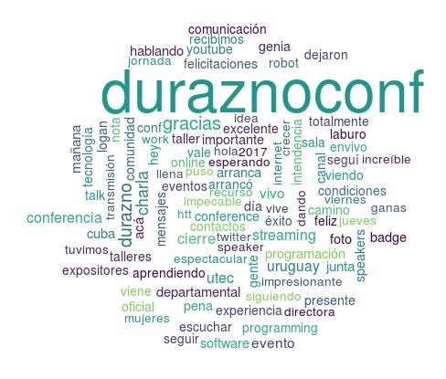
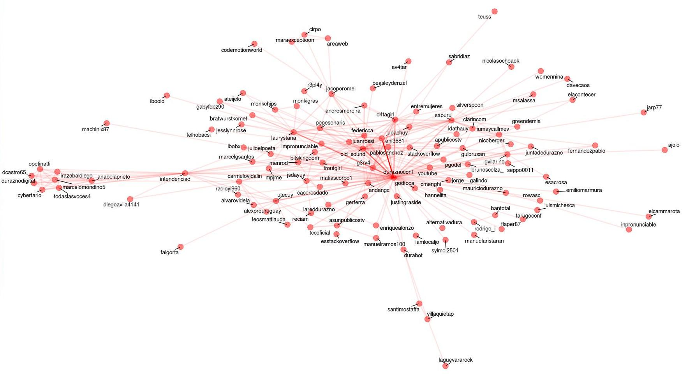

<p align="center">
  
</p>


Les dejo acá el código de las imágenes que mostré en la [DuraznoConf](http://duraznoconf.uy/) de los tweets mencionando a la conferencia, por si se animan a jugar con algo de ésto con sus propias búsquedas de palabras en Twitter.

Que se diviertan!

```{r setup, echo = FALSE}
tweets <- readRDS("tweets")

# Me quedo con una versión vieja de los tweets (del día antes de la conferencia), porque
# la API de Twitter sólo muestras los últimos 7 días de tweets
```

Cargo las librerías que uso:

```{r message=FALSE, warning=FALSE}
library(dplyr)
library(rtweet)
library(wordcloud)
library(igraph)
library(viridis)
library(tm)
library(stringr)
library(widyr)
library(ggraph)
library(tidytext)
library(rcorpora)
library(purrr)
library(emo)
```

Bajo tweets que hablen de la DuraznoConf y miro los primeros

```{r eval = FALSE}
tweets <- rtweet::search_tweets(q = "@DuraznoConf OR to:DuraznoConf OR DuraznoConf", 
                                include_rts = FALSE) 

head(tweets)
```

Extraigo la info de los usuarios que hablaron de la DuraznoConf:
```{r eval = FALSE}
users <- toString(tweets$screen_name) %>%
  str_split(pattern = " ", simplify = TRUE)
```

Hago una nube de palabras con los usuarios que hablaron de la DuraznoConf:

```{r eval = FALSE}
set.seed(16995145)
wordcloud(users, colors = viridis::viridis_pal(end = 0.8)(10),
          min.freq = 800, random.color = TRUE, max.words = 100,
          scale = c(3.5,.8), rot.per=.3)
```

<p align="center">
  
</p>

Selecciono las palabras comúnes como "el", "es", "la" para que no las tome en cuenta:

```{r message=FALSE, warning=FALSE}
stopwords <- corpora("words/stopwords/en")$stopWords
stopwords <- c(stopwords, corpora("words/stopwords/es")$stopWords, "t.co", "https", "ésto")
```

Veo qué palabras son las más usadas en los Tweets que mencionan a la DuraznoConf, sacando las menciones y las urls:

```{r message=FALSE, warning=FALSE}
words <- data_frame(text = tweets$text) %>% 
  mutate(text = str_replace_all(text, '@([a-zA-Z0-9\\_\\.]+)', ''),
         text = str_replace_all(text, 'https:([a-zA-Z0-9\\_\\.\\/]+)', '')) %>% 
  unnest_tokens(word, text) %>% 
  filter(!word %in% stopwords)

words_used <- toString(words$word) %>%
  str_split(pattern = " ", simplify = TRUE)
```

Hago una nube de palabras con las palabras usadas en los Tweets que mencionaron a la DuraznoConf:

```{r eval = FALSE}
set.seed(1699351)
wordcloud(words_used, colors = viridis::viridis_pal(end = 0.8)(10),
          min.freq = 2, random.color = TRUE, max.words = 40,
          scale = c(3.5,.2), rot.per=.2)
```

<p align="center">
  
</p>

Preparo los datos para armar la red de los mencionados en los Tweets:

```{r message=FALSE, warning=FALSE}
mentioned_users <- tweets %>% 
  mutate(mentions = map_chr(.$mentions_screen_name, paste0, collapse = " ")) %>% 
  select(status_id, mentions, screen_name, reply_to_screen_name)
```


Construyo la red de los usuarios que hablaron de la DuraznoConf y cómo se vincularon entre ellos:

```{r eval = FALSE}
set.seed(365464)
data_frame(users = mentioned_users$mentions, status_id = mentioned_users$status_id)  %>% 
  unnest_tokens(user, users) %>% 
  pairwise_count(user, status_id, sort = TRUE, upper = FALSE) %>% 
  graph_from_data_frame() %>%
  ggraph(layout = "fr") +
  geom_edge_link(aes(edge_alpha = n), show.legend = FALSE,edge_colour = "red", edge_width = 1,
                 end_cap = circle(.07, 'inches')) +
  geom_node_point(color = "red", size = 5, alpha = .5) +
  geom_node_text(aes(label = name), repel = TRUE, 
                 point.padding = unit(0.2, "lines"), vjust = 1, hjust = 1) +
  theme_void()
```

Y ésto es lo que se ve `r emo::ji("tada")`




Para tener una versión actual, no podemos usar los datos de la REST API de Twitter porque sólo devuelve los tweets de los últimos 6-9 días. Pero gracias a [@g3rv4](https://twitter.com/g3rv4), también conocido como "El esposo de Daniela `r emo::ji("unicorn")`"  tenemos a [@Durabot](https://twitter.com/durabot), que es un bot duraznense que hace RT de todas las menciones a [@DuraznoConf](https://twitter.com/duraznoconf) o #DuraznoConf. Así que podemos ver cómo quedan estas imágenes si consideramos todos estos tweets!

```{r eval=FALSE}
durabot <- rtweet::get_timeline(user = "durabot", 
                                n = 3200,
                                include_rts = FALSE) 

```

```{r echo = FALSE, message=FALSE, warning=FALSE}
durabot <- readRDS("durabot_timeline_20171212")

```

Como son todos RT, y los RT siempre empiezan igual: `RT @screen_name:`, extraigo el `screen_name` de esta parte del `text` del tweet con una expresión regular.

```{r}
durabot <- durabot %>% 
  mutate(screen_name_RT = str_extract(text, "^RT @(.[^ :]*)"),
         screen_name_RT = str_replace(screen_name_RT, "RT @", "")) 
```


Extraigo la info de los usuarios que hablaron de la DuraznoConf:

```{r eval = FALSE}
users_durabot <- toString(durabot$screen_name_RT) %>%
  str_split(pattern = " ", simplify = TRUE)
```

Hago una nube de palabras con los usuarios que hablaron de la DuraznoConf:

```{r eval = FALSE, dpi=150}
set.seed(16995145)
wordcloud(users_durabot, colors = viridis::viridis_pal(end = 0.8)(10),
          min.freq = 800, random.color = TRUE, max.words = 100,
          scale = c(4.5,.8), rot.per=.3)
```

<p align="center">
  
</p>

Veo qué palabras son las más usadas en los Tweets que RT Durabot, sacando las menciones y las urls:

```{r message=FALSE, warning=FALSE}
words_durabot <- data_frame(text = durabot$text) %>% 
  mutate(text = str_replace_all(text, '@([a-zA-Z0-9\\_\\.]+)', ''),
         text = str_replace_all(text, '^RT ', ''),
         text = str_replace_all(text, 'https:([a-zA-Z0-9\\_\\.\\/]+)', '')) %>% 
  unnest_tokens(word, text) %>% 
  filter(!word %in% stopwords)

words_durabot <- toString(words_durabot$word) %>%
  str_split(pattern = " ", simplify = TRUE)
```

Hago una nube de palabras con las palabras usadas en los Tweets que mencionaron a la DuraznoConf:

```{r eval = FALSE}
set.seed(1699351)
wordcloud(words_durabot, colors = viridis::viridis_pal(end = 0.8)(10),
          min.freq = 3, random.color = TRUE, max.words = 100,
          scale = c(4, .8), rot.per=.2)
```

<p align="center">
  
</p>

Preparo los datos para armar la red de los mencionados en los Tweets:

```{r message=FALSE, warning=FALSE}
mentioned_users_durabot <- durabot %>% 
  mutate(mentions = map_chr(.$mentions_screen_name, paste0, collapse = " ")) %>% 
  select(status_id, mentions, screen_name, reply_to_screen_name)
```

Construyo la red de los usuarios que hablaron de la DuraznoConf y cómo se vincularon entre ellos:

```{r eval = FALSE}
set.seed(365464)
data_frame(users = mentioned_users_durabot$mentions, status_id = mentioned_users_durabot$status_id)  %>% 
  unnest_tokens(user, users) %>% 
  pairwise_count(user, status_id, sort = TRUE, upper = FALSE) %>% 
  filter(n > 1) %>% 
  graph_from_data_frame() %>%
  ggraph(layout = "fr") +
  geom_edge_link(aes(edge_alpha = n), show.legend = FALSE,edge_colour = "red", edge_width = 1,
                 end_cap = circle(.07, 'inches')) +
  geom_node_point(color = "red", size = 5, alpha = .5) +
  geom_node_text(aes(label = name), repel = TRUE, 
                 point.padding = unit(0.2, "lines"), vjust = 1, hjust = 1) +
  theme_void()
```

